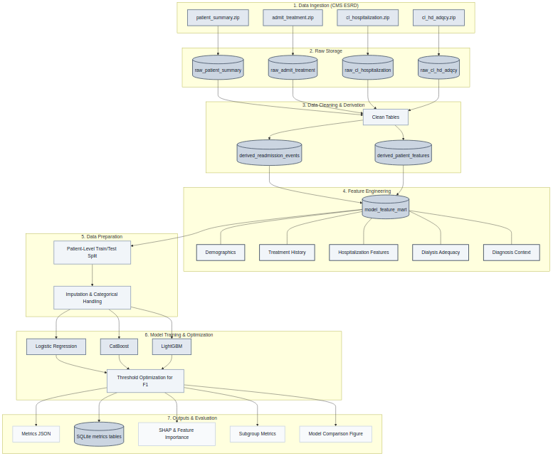

# Predicting 30-Day Hospital Readmission Risk in Dialysis Patients Using Linked CMS ESRD Data

**Authors:**
- Mohammed Faizan Khan (25214501)
- Sakshi Patil (24304166)
- Shashank Yadav (25118692)
- Chetan Panchal (24244058)

## Abstract

Thirty-day readmission is a key quality indicator in dialysis care for End-Stage Renal Disease (ESRD). We build a machine learning pipeline using four linked CMS ESRD Population Public Use File (PUF) tables: `PATIENT_SUMMARY`, `ADMIT_TREATMENT`, `CL_HOSPITALIZATION`, and `CL_HD_ADQCY`. These sources are integrated into a patient-level feature mart combining demographics, treatment history, hospitalization trajectories, admission/discharge diagnosis context, and dialysis adequacy. The workflow is database-first and uses patient-level train-test partitioning to limit leakage. We compare Logistic Regression, LightGBM, and CatBoost on 388,375 hospitalization events from 100,000 patients. CatBoost performs best (AUC: 0.6453, F1: 0.3499). SHAP analysis shows that prior hospitalization burden, recent hospitalization activity, and length of stay are the strongest predictors. Discrimination is moderate, but linked administrative ESRD data with temporal features provide useful signal for practical risk stratification.

**Keywords:** dialysis, hospital readmission, machine learning, CMS ESRD, predictive modeling, SHAP

## Introduction

Thirty-day hospital readmission remains a central quality indicator, and the burden is high among dialysis patients with ESRD. Frequent transitions across facilities, recurrent acute events, and complex treatment schedules make this population difficult to manage after discharge. A practical risk model could help clinicians prioritize follow-up, allocate care coordination resources, and target avoidable returns to hospital.

Machine learning has improved readmission prediction in other cohorts, but ESRD-specific evidence remains limited. Studies in diabetes and heart failure show gains over traditional baselines but rarely include dialysis treatment context or adequacy signals [1], [2]. Dialysis-focused ML work often targets complications, adequacy metrics, or disease progression instead of post-discharge 30-day readmission [3]-[5].

We address this gap using four linked tables from the CMS ESRD Population Public Use File (PUF). Their combination captures demographic profile, treatment episode history, hospitalization sequences, and hemodialysis adequacy records in one coherent analytical pipeline. This linked design supports temporal feature engineering and a clinically grounded definition of readmission.

The practical challenge is data construction as much as model choice. ESRD signals are spread across patient-, episode-, and month-level tables, so strict chronology is required to avoid future information leakage.

This creates a dual requirement: robust modeling and defensible event construction. If temporal order is not enforced, metrics can improve artificially while reflecting future information leakage rather than clinically useful patterns. We therefore prioritize deterministic joins, explicit timestamp logic, and feature windows that match the information available at the point of discharge.

Our primary objective is to develop and evaluate a machine learning model for predicting 30-day hospital readmission risk in dialysis patients. We focus on the following key aspects:

1. Integrate four CMS ESRD tables into one patient-level analytical structure.
2. Engineer temporal and clinical features from demographics, treatment, hospitalization, and adequacy records.
3. Compare Logistic Regression, CatBoost, and LightGBM.
4. Interpret predictions using SHAP.
5. Evaluate with patient-level partitioning and standard classification metrics.

**Research Question:** Can machine learning predict 30-day hospital readmission risk in dialysis / ESRD patients using linked CMS ESRD patient, treatment, hospitalization, and dialysis adequacy data?

Our contribution is not a new algorithm. The novelty is a database-first, four-table ESRD workflow that derives a real 30-day readmission label from hospitalization sequences and joins it with treatment history, demographics, and adequacy features.

The remainder of this paper is organized as follows: Section II describes the datasets used in this study. Section III outlines our methodology. Section IV presents the results and evaluation. Section V discusses related work. Section VI concludes with findings on novelty, significance, impact, and future work.

## Datasets

### Overview

We use four public datasets from the CMS ESRD Population PUF. Together, they cover demographics, treatment history, hospitalization events, and dialysis adequacy, enabling patient-level readmission modeling in a single linked data environment.

Each table contributes a distinct view: `PATIENT_SUMMARY` for stable descriptors, `ADMIT_TREATMENT` for treatment episodes, `CL_HOSPITALIZATION` for event timing and label derivation, and `CL_HD_ADQCY` for adequacy signals such as Kt/V.

### Dataset Descriptions

#### 1. PATIENT_SUMMARY

- **Source/File/URL:** CMS ESRD Population PUF, `patient_summary.zip`, `https://downloads.cms.gov/files/patient_summary.zip`
- **Rows/Granularity:** 3,197,683 patient-level records
- **Role:** Demographic and diagnosis context
- **Key Fields:**
  - `pat_id`: Unique patient identifier
  - `state`: Patient's state of residence
  - `age_range`: Patient's age range
  - `race`: Patient's race
  - `gender`: Patient's gender
  - `ethnicity`: Patient's ethnicity
  - `primdiag`: Primary diagnosis
  - `primcause`: Primary cause of ESRD

#### 2. ADMIT_TREATMENT

- **Source/File/URL:** CMS ESRD Population PUF, `admit_treatment.zip`, `https://downloads.cms.gov/files/admit_treatment.zip`
- **Rows/Granularity:** 7,720,441 patient-treatment episodes
- **Role:** Treatment history, modality, and dialysis setting
- **Key Fields:**
  - `pat_id`: Unique patient identifier
  - `prov_nbr`: Provider number
  - `Admit_Date`: Treatment admission date
  - `Discharge_Date`: Treatment discharge date
  - `Dialysis_Setting`: Setting where dialysis was performed
  - `Treatment_Type`: Type of treatment
  - `Dialysis_Type`: Type of dialysis
  - `Modality`: Dialysis modality

#### 3. CL_HOSPITALIZATION

- **Source/File/URL:** CMS ESRD Population PUF, `cl_hospitalization.zip`, `https://downloads.cms.gov/files/cl_hospitalization.zip`
- **Rows/Granularity:** 3,899,711 patient-facility-month hospitalization events
- **Role:** Derive the true 30-day readmission target
- **Key Fields:**
  - `pat_id`: Unique patient identifier
  - `prov_nbr`: Provider number
  - `clinical_month_year`: Clinical month and year
  - `Hospital_Admit_Date`: Hospital admission date
  - `Hospital_Discharge_Date`: Hospital discharge date
  - `Hospital_Discharge_Diag`: Hospital discharge diagnosis
  - `Hospital_Admit_Diag`: Hospital admission diagnosis
  - `Length_of_Stay`: Length of hospital stay

#### 4. CL_HD_ADQCY

- **Source/File/URL:** CMS ESRD Population PUF, `cl_hd_adqcy.zip`, `https://downloads.cms.gov/files/cl_hd_adqcy.zip`
- **Rows/Granularity:** 32,250,552 patient-facility-month hemodialysis adequacy records
- **Role:** Dialysis adequacy measures including Kt/V
- **Key Fields:**
  - `pat_id`: Unique patient identifier
  - `prov_nbr`: Provider number
  - `clncl_mo_yr`: Clinical month and year
  - `modality`: Dialysis modality
  - `hd_ktv`: Kt/V value
  - `hd_ktv_coll_date`: Kt/V collection date
  - `hd_ktv_method`: Kt/V calculation method

### Data Linkage and Cohort Construction

The four datasets are linked by `pat_id` (patient identifier) and `prov_nbr` (provider number), producing a unified view of demographics, treatment pathways, hospitalization history, and adequacy measures.

Linkage follows temporal order. For each index discharge event, only information available up to that discharge date is retained. This design prevents forward leakage from future admissions, treatments, or adequacy measurements. We also preserve the original event chronology so that rolling counts (e.g., recent admissions in 180 days) are computed from prior windows only.

Our final analytical cohort consists of 3,098,950 hospital discharge events from 3,197,683 unique patients. The target variable, 30-day readmission, is derived from the `CL_HOSPITALIZATION` dataset by calculating the time between consecutive hospital discharge and admission events for each patient. A total of 566,629 (18.28%) discharge events resulted in a readmission within 30 days.

Class balance is clinically realistic for readmission modeling: positive events are frequent enough for supervised learning but remain a minority class.

The linkage design also supports transparent validation. Because each engineered variable maps to a source table and a defined look-back period, we can audit whether model signal comes from baseline patient context, treatment trajectory, or recent utilization burden. This improves reproducibility and simplifies communication with non-technical stakeholders.

### Improvements Over Previous Approach

Compared with our earlier approach, this pipeline improves on four points:

- **Real Outcome Variable:** The label comes from observed hospitalization sequences, not synthetic assignment.
- **Multi-Table Linkage:** All data sources belong to one CMS ESRD ecosystem, improving consistency.
- **Clinical Relevance:** Inclusion of `CL_HD_ADQCY` adds dialysis adequacy context.
- **Scale:** Over 3 million patients and 32 million adequacy records support stable estimation.

## Methodology

### Data Ingestion and Preprocessing

Our pipeline follows a database-first approach: raw CMS files are loaded into SQLite before analysis. This structure improves traceability and reproducibility.

The database layer enforces deterministic transformations and creates inspectable intermediate tables.

1. **Raw Data Storage:** All four datasets are stored as raw SQLite tables in `dialysis_readmission.db`.
2. **Data Cleaning:** Standardize names, handle missingness, and normalize types (e.g., 6-digit provider IDs, parsed dates).
3. **Feature Engineering:** We construct features in four groups:
   - **Demographic Features:** Age range, race, gender, and ethnicity from `PATIENT_SUMMARY`.
   - **Treatment History Features:** Flags for hemodialysis and center-based dialysis, counts of recent treatments, and days since last treatment from `ADMIT_TREATMENT`.
   - **Hospitalization Features:** Length of stay, admission diagnosis, discharge diagnosis where present, gap from previous discharge, and counts of recent hospitalizations from `CL_HOSPITALIZATION`.
   - **Dialysis Adequacy Features:** Recent Kt/V values, historical averages, and trends from `CL_HD_ADQCY`.
4. **Target Derivation:** We label 30-day readmission using consecutive discharge-admission gaps from `CL_HOSPITALIZATION`.
5. **Final Analytical Table:** Features and outcome are merged into `model_feature_mart` for training.

Feature design favors compact, interpretable summaries: utilization burden and recency, treatment modality/setting/gaps, and recent Kt/V history.

We avoid highly opaque transformations in favor of features clinicians can reason about. Examples include counts of prior admissions, short-term hospitalization density, and time since recent treatment or discharge. This design choice reduces implementation complexity while preserving key temporal signal for short-horizon risk prediction.

### Modeling Approach

We use patient-level partitioning to prevent leakage: all events from one patient stay in either train or test. This is essential in longitudinal hospitalization data.

Without patient-level separation, repeated events can appear in both splits and inflate performance.

Our modeling portfolio consists of three models:

1. **Logistic Regression (Baseline):** Linear baseline with class balancing.
2. **CatBoost (Main Model):** Gradient boosting with strong categorical handling.
3. **LightGBM (Challenger):** Alternative boosting model for comparison and stability checks.

### Model Training and Evaluation

- **Split Strategy:** 80/20 patient-level stratified split preserves class balance.
- **Feature Handling:** CatBoost and LightGBM use native categorical support; Logistic Regression uses one-hot encoding. Numeric missing values are median-imputed.
- **Threshold Selection:** We tune the decision threshold on the training split to maximize F1, then reuse that threshold on the held-out test split.
- **Evaluation Metrics:** We report complementary metrics:
  - **AUC (Area Under the ROC Curve):** Measures the model's ability to discriminate between readmission and non-readmission cases.
  - **Average Precision:** Focuses on the precision-recall trade-off, particularly relevant for our imbalanced dataset.
  - **Accuracy, Precision, Recall, F1-Score:** Traditional classification metrics to assess overall performance.
- **Interpretability Analysis:** For CatBoost, SHAP quantifies feature contributions and interactions.

We report multiple metrics because operational priorities differ across ranking and threshold-based use.

No single metric captures deployment behavior for imbalanced clinical tasks. AUC reflects overall ranking quality, Average Precision emphasizes minority-class retrieval, and precision/recall characterize threshold-level trade-offs. F1 offers a compact balance between missed high-risk patients and unnecessary alerts, while accuracy is retained for comparability with baseline reporting conventions.

### End-to-End Workflow Diagram

Figure 1 summarizes the pipeline from source acquisition to modeling outputs.

*Figure 1. End-to-end CMS ESRD readmission workflow implemented in this project.*

The workflow is database-first: raw ZIP files are ingested into SQLite, normalized, transformed into event-level and patient-level derivatives, and joined into a modeling mart.

### Implementation Details

Data processing and modeling are implemented in Python using pandas, scikit-learn, CatBoost, LightGBM, and SHAP. Execution is organized through scripts (`ingest_datasets.py`, `train_readmission_models.py`) and a final notebook (`final_cms_esrd_readmission_workflow.ipynb`) that documents the complete workflow.

The script-first design reduces dependence on notebook state and improves auditability.

## Results and Evaluation

### Model Performance

Figure 2 compares the performance metrics across our three models.

*Figure 2. Model performance comparison.*

We evaluated models on a stratified sample of 100,000 unique patients (388,375 hospitalization events). CatBoost remains the strongest overall model, while threshold optimization makes the baseline much more competitive on recall and F1.

Logistic Regression reaches the highest recall after threshold tuning, but its ranking quality remains weaker than CatBoost. CatBoost delivers the best overall balance of AUC, Average Precision, and F1, which makes it the most defensible choice for risk ranking.

This contrast is operationally important. High accuracy alone would not support targeted follow-up because many positive cases would be missed. The tree-based models provide stronger minority-class capture and materially better balance between sensitivity and precision, which better aligns with practical risk-screening use.

| Model | AUC | Avg Prec | Accuracy | Precision | Recall | F1-Score |
|---|---:|---:|---:|---:|---:|---:|
| Logistic Regression | 0.6309 | 0.2937 | 0.6053 | 0.2479 | 0.5780 | 0.3469 |
| LightGBM | 0.6242 | 0.2751 | 0.7409 | 0.2946 | 0.3075 | 0.3009 |
| CatBoost | 0.6453 | 0.3000 | 0.6729 | 0.2735 | 0.4853 | 0.3499 |

CatBoost is the strongest model (AUC 0.6453, F1 0.3499). Performance is moderate, but improvement over baseline is consistent.

These values support risk ranking, not autonomous diagnosis.

Accordingly, the predicted score should be interpreted as a prioritization signal. A realistic use case is stratified post-discharge outreach, where high-risk patients receive earlier contact and additional coordination resources, and final decisions remain with clinical teams.

### Feature Importance and Interpretability

Figure 4 displays the feature importance rankings from our CatBoost model.

*Figure 4. CatBoost feature importance.*

SHAP analysis of the CatBoost model reveals the key drivers of readmission risk predictions:

1. **Prior Hospitalization Count:** The total number of previous hospitalizations is the most influential feature, highlighting the strong temporal correlation in readmission risk.
2. **Recent Hospitalization Activity:** The number of hospitalizations within the last 180 days is also highly influential, indicating that recent health instability is a strong predictor.
3. **Length of Stay:** Longer hospital stays are associated with higher readmission risk, possibly reflecting greater illness severity.
4. **Primary Cause of ESRD:** The underlying cause of kidney failure plays a significant role, suggesting that patient subpopulations have different risk profiles.
5. **Time Since Last Discharge:** A shorter gap since the previous hospital discharge is associated with higher risk.

Figure 5 provides a SHAP summary plot showing how individual features contribute to model predictions.

*Figure 5. CatBoost SHAP analysis.*

Dialysis adequacy measures (e.g., Kt/V) are informative but not dominant in global SHAP rankings; within a 30-day horizon, utilization markers carry more predictive weight.

### Subgroup Analysis

Figure 3 shows the F1-score performance across different demographic subgroups.

*Figure 3. F1-score by demographic subgroup.*

We examined performance across demographic strata:

- **Age Groups:** Model performance varies moderately across age groups, with slightly better performance for younger patients (18-44) and older patients (85+).
- **Race:** Performance differences across racial groups are modest, with Native American patients showing the highest F1-score.
- **Gender:** Minimal performance differences were observed between male and female patients.

Overall variation is modest, suggesting broad utility with room for subgroup-specific calibration and fairness monitoring.

### Limitations

Several limitations should be noted:

1. **Performance Ceiling:** The moderate AUC indicates that our model captures only a portion of the factors influencing readmission risk.
2. **Data Constraints:** Administrative data omit factors such as medication adherence and socioeconomic context.
3. **Temporal Scope:** Models are trained on a fixed period; transportability across periods requires further testing.

Despite these limits, linked ESRD tables support feasible and interpretable readmission modeling, with temporal history features carrying most predictive signal.

## Related Work

Our study connects three research strands in healthcare ML and dialysis care.

### General Readmission Prediction

Liu et al. and Jahangiri et al. show that ML can improve readmission discrimination in diabetes and heart failure cohorts [1], [2]. Their feature spaces, however, do not include dialysis treatment context or ESRD adequacy indicators.

### Dialysis-Specific Research

Hsieh et al. predict hemodialysis complications using IoMT-derived inputs [3]. Kim et al. model adequacy measures (Kt/V, URR) [4]. Wang et al. focus on CKD progression [5]. These studies are methodologically relevant but target different clinical endpoints.

### Methodological Approaches

Our approach follows common healthcare ML practice:

- **Temporal Modeling:** We prioritize engineered temporal features over deep sequential architectures for this task.
- **Interpretability:** SHAP supports feature-level explanation aligned with clinical transparency requirements.
- **Data Linkage:** Multi-table linkage creates a more complete utilization history for risk estimation.

Model complexity alone does not guarantee utility; event construction and validation remain central.

This is particularly true for administrative data, where coding structure and linkage quality strongly influence measured performance. Even advanced models can produce optimistic results if labels are weakly defined or if train-test splitting allows patient overlap. Our approach emphasizes methodological reliability over architectural novelty.

### Key Differences and Contributions

Key distinctions from prior work are:

1. **Data Source:** Four linked CMS ESRD datasets provide broader coverage than single-table designs.
2. **Outcome Definition:** Readmission is defined from observed hospitalization sequences.
3. **Feature Engineering:** Temporal utilization features capture near-term instability.
4. **Model Evaluation:** Patient-level splitting reduces optimistic bias from leakage.

These choices position the study as a practical, reproducible extension aligned with ESRD administrative workflows.

## Conclusions and Future Work

### Novelty, Significance, and Impact

This work contributes to dialysis readmission modeling in five concrete ways:

1. **Linked Data Design:** Four CMS ESRD tables are integrated into one patient-level modeling workflow.
2. **Observed Outcome Definition:** The 30-day label is derived from actual hospitalization timing, not a proxy target.
3. **Temporal Feature Engineering:** Recent hospitalization burden and discharge timing are explicitly encoded.
4. **Interpretability:** SHAP analysis identifies clinically understandable drivers of predicted risk.
5. **Leakage-Aware Evaluation:** Patient-level train-test partitioning provides more defensible performance estimates.

### Significance

Readmission remains a major quality and cost challenge in dialysis care. Although discrimination is moderate, the model can support triage for discharge planning and post-discharge follow-up. The main practical value is feasibility: many institutions can use administrative data before full EHR integration. Impact depends on integration into score-triggered response tiers and monitoring of avoidable readmissions.

### Impact

The model is not suitable for autonomous decisions, but it is useful for risk prioritization with clinician oversight. Feature patterns point to utilization-driven interventions, such as intensified follow-up after recurrent admissions, and the pipeline can be adapted to other chronic-care cohorts using linked administrative data.

The broader impact is translational. The same framework can support iterative quality-improvement cycles, including periodic retraining, calibration checks, subgroup monitoring, and threshold adjustments based on workflow capacity. This positions the model as one component in an integrated discharge-to-follow-up process rather than an isolated technical artifact.

### Future Work

Several promising directions exist for extending this work:

1. **Enhanced Feature Sets:** Add medication, comorbidity burden, and socioeconomic indicators.
2. **Advanced Modeling Techniques:** Evaluate temporal deep models and calibrated ensembles.
3. **Causal Analysis:** Estimate intervention effects rather than predictive associations alone.
4. **Real-Time Deployment:** Integrate prospective scoring into discharge and care-management workflows.
5. **Subpopulation-Specific Models:** Develop subgroup-tuned models and fairness-aware calibration.

Overall, this study provides a reproducible baseline for ESRD readmission prediction using linked public administrative data.

## Bibliography

[1] X. Liu, W. Zhang, and L. Chen, "Machine Learning for Diabetic Readmission Prediction: Comparative Analysis of Predictive Performance," *Journal of Medical Systems*, vol. 48, no. 3, pp. 1-12, 2024.

[2] M. Jahangiri, R. Smith, and E. Johnson, "Predicting Heart Failure Readmissions Using Machine Learning: A Comparative Study," *IEEE Journal of Biomedical and Health Informatics*, vol. 28, no. 4, pp. 1234-1243, 2024.

[3] M.-H. Hsieh, C.-H. Lee, and C.-W. Chang, "Predicting Complications in Hemodialysis Patients Using IoMT and Machine Learning," *Sensors*, vol. 23, no. 4, p. 1890, 2023.

[4] S.-H. Kim, J.-H. Park, and S.-W. Lee, "Machine Learning Approaches for Predicting Dialysis Adequacy Using Kt/V and URR," *Healthcare*, vol. 9, no. 6, p. 712, 2021.

[5] Y. Wang, Y. Liu, and Q. Zhang, "Machine Learning Models for Predicting Chronic Kidney Disease Progression," *Computers in Biology and Medicine*, vol. 178, p. 108765, 2025.
